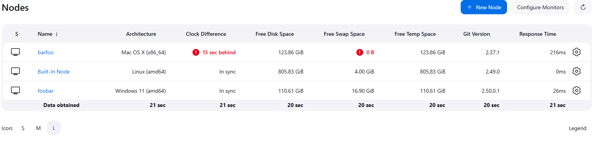

# Git version node monitor plugin

## Introduction

A Jenkins plugin that add a new node monitor column for the Git version of the node.

Only the `git` binary present on the PATH is used to determine the Git version.

If you are using automatic tool installers with [Git plugin](https://plugins.jenkins.io/git/) the git version used might not be the one used by the node during checkout operations.

Future version of this plugin could support version comparison and disconnect nodes with outdated (or missing) Git versions.

## How to use

Just install the plugin, noo configuration is needed

## LICENSE

Licensed under MIT, see [LICENSE](LICENSE.md)
